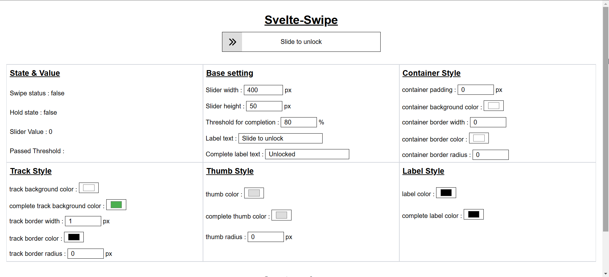

# Svelte-Swipe-To-Action

A highly customizable swipe-to-action component for Svelte applications.



## Table of Contents

- [Introduction](#introduction)
- [Installation](#installation)
- [Basic Usage](#basic-usage)
- [Props](#props)
  - [State Props](#state-props)
  - [Appearance Props](#appearance-props)
  - [Event Handlers](#event-handlers)
  - [Custom Icons](#custom-icons)
- [Examples](#examples)
- [Development](#development)
- [License](#license)

## Introduction

Svelte-Swipe-To-Action is a versatile slider component for Svelte applications building on a html input element type range, that provides "swipe to unlock" or "swipe to confirm" functionality. It's fully customizable with extensive styling options and event callbacks.

## Installation

```bash
npm install svelte-swipe-to-action
```

or

```bash
pnpm i svelte-swipe-to-action
```

## Basic Usage

```svelte
<script>
	import Swipe from 'svelte-swipe-to-action';

	let status = false;

	function handleComplete(event, isComplete, value) {
		console.log('Action completed!', isComplete, value);
	}
</script>

<Swipe
	bind:status
	label="Slide to confirm"
	completeLabel="Confirmed!"
	oncomplete={handleComplete}
/>
```

## Props

### State Props

| Prop        | Type      | Default      | Description                                          |
| ----------- | --------- | ------------ | ---------------------------------------------------- |
| `status`    | `boolean` | `false`      | Whether the slider is in completed state             |
| `value`     | `number`  | `0` or `100` | The current value of the slider (0-100)              |
| `hold`      | `boolean` | `false`      | Whether the slider is being held                     |
| `threshold` | `number`  | `80`         | Percentage threshold required for completion (0-100) |

### Appearance Props

#### Container

| Prop                   | Type     | Default         | Description                              |
| ---------------------- | -------- | --------------- | ---------------------------------------- |
| `width`                | `number` | `400`           | Width of the slider in pixels            |
| `height`               | `number` | `50`            | Height of the slider in pixels           |
| `containerPadding`     | `number` | `0`             | Padding of the container in pixels       |
| `containerColor`       | `string` | `'transparent'` | Background color of the container        |
| `containerBorderColor` | `string` | `'transparent'` | Border color of the container            |
| `containerBorderWidth` | `number` | `0`             | Border width of the container in pixels  |
| `containerRadius`      | `number` | `0`             | Border radius of the container in pixels |
| `containerClass`       | `string` | `''`            | Additional CSS class for the container   |

#### Track

| Prop                 | Type     | Default         | Description                                       |
| -------------------- | -------- | --------------- | ------------------------------------------------- |
| `trackColor`         | `string` | `'#fff'`        | Background color of the track                     |
| `completeTrackColor` | `string` | `'#4caf50'`     | Background color of the track when completed      |
| `trackBorderColor`   | `string` | `'transparent'` | Border color of the track                         |
| `trackBorderWidth`   | `number` | `1`             | Border width of the track in pixels               |
| `trackRadius`        | `number` | `0`             | Border radius of the track in pixels              |
| `trackClass`         | `string` | `''`            | Additional CSS class for the track                |
| `completeTrackClass` | `string` | `''`            | Additional CSS class for the track when completed |

#### Thumb

| Prop                 | Type     | Default  | Description                          |
| -------------------- | -------- | -------- | ------------------------------------ |
| `thumbColor`         | `string` | `'#ddd'` | Color of the thumb                   |
| `completeThumbColor` | `string` | `'#ddd'` | Color of the thumb when completed    |
| `thumbRadius`        | `number` | `0`      | Border radius of the thumb in pixels |

#### Label

| Prop                 | Type     | Default          | Description                                 |
| -------------------- | -------- | ---------------- | ------------------------------------------- |
| `label`              | `string` | `'Slide to ...'` | Text displayed on the slider                |
| `labelColor`         | `string` | `'#000'`         | Color of the label text                     |
| `labelClass`         | `string` | `''`             | Additional CSS class for the label          |
| `completeLabel`      | `string` | `'Complete'`     | Text displayed when slider is completed     |
| `completeLabelColor` | `string` | `'#000'`         | Color of the complete label text            |
| `completeLabelClass` | `string` | `''`             | Additional CSS class for the complete label |

### Event Handlers

| Prop              | Type                                 | Description                                                            |
| ----------------- | ------------------------------------ | ---------------------------------------------------------------------- |
| `oncomplete`      | `function(event, isComplete, value)` | Called when the slider completes (passes threshold and is released)    |
| `oncancel`        | `function(event, isComplete, value)` | Called when the slider is canceled (released before passing threshold) |
| `onpassthreshold` | `function(event, side, value)`       | Called when the slider passes the threshold in either direction        |

### Custom Icons

| Prop        | Type      | Description                                                      |
| ----------- | --------- | ---------------------------------------------------------------- |
| `chevron`   | `Snippet` | Custom icon for the slider thumb (Svelte snippet)                |
| `checkMark` | `Snippet` | Custom icon for the slider thumb when completed (Svelte snippet) |

## Examples

### Basic Slide to Unlock

```svelte
<script>
	import Swipe from 'svelte-swipe';
	let unlocked = false;
</script>

<Swipe
	bind:status={unlocked}
	label="Slide to unlock"
	completeLabel="Unlocked!"
	completeTrackColor="#4caf50"
	threshold={75}
/>

{#if unlocked}
	<p>Device unlocked!</p>
{/if}
```

### Custom Styled Slider

```svelte
<script>
	import Swipe from 'svelte-swipe';
	let confirmed = false;
</script>

<Swipe
	bind:status={confirmed}
	width={300}
	height={60}
	containerRadius={30}
	containerBorderWidth={2}
	containerBorderColor="#ddd"
	trackRadius={28}
	trackColor="#f5f5f5"
	completeTrackColor="#007bff"
	thumbColor="#007bff"
	completeThumbColor="#fff"
	thumbRadius={28}
	label="Swipe to confirm"
	completeLabel="Confirmed!"
	labelColor="#666"
	completeLabelColor="#fff"
/>
```

### With Custom Icons

```svelte
<script>
	import Swipe from 'svelte-swipe';
	import { HandSwipeRight, Heart } from 'phosphor-svelte';
</script>

<Swipe label="Slide to confirm" completeLabel="Done!">
	{#snippet chevron()}
		<HandSwipeRight />
	{/snippet}
	{#snippet checkMark()}
		<Heart color="HotPink" weight="fill" />
	{/snippet}
</Swipe>
```

### With Event Handlers

```svelte
<script>
	import Swipe from 'svelte-swipe';
	let message = '';

	function handleComplete(event, isComplete, value) {
		message = 'Action completed!';
	}

	function handleCancel(event, isComplete, value) {
		message = 'Action canceled!';
	}

	function handleThreshold(event, side, value) {
		message = side ? 'Passed threshold' : 'Below threshold';
	}
</script>

<Swipe
	oncomplete={handleComplete}
	oncancel={handleCancel}
	onpassthreshold={handleThreshold}
	label="Slide to submit"
	completeLabel="Submitted!"
/>

<p>{message}</p>
```

## Development

To run the development server:

```bash
npm run dev
```

To build the library:

```bash
npm run build
```

## License

MIT License

Copyright (c) 2023

Permission is hereby granted, free of charge, to any person obtaining a copy
of this software and associated documentation files (the "Software"), to deal
in the Software without restriction, including without limitation the rights
to use, copy, modify, merge, publish, distribute, sublicense, and/or sell
copies of the Software, and to permit persons to whom the Software is
furnished to do so, subject to the following conditions:

The above copyright notice and this permission notice shall be included in all
copies or substantial portions of the Software.

THE SOFTWARE IS PROVIDED "AS IS", WITHOUT WARRANTY OF ANY KIND, EXPRESS OR
IMPLIED, INCLUDING BUT NOT LIMITED TO THE WARRANTIES OF MERCHANTABILITY,
FITNESS FOR A PARTICULAR PURPOSE AND NONINFRINGEMENT. IN NO EVENT SHALL THE
AUTHORS OR COPYRIGHT HOLDERS BE LIABLE FOR ANY CLAIM, DAMAGES OR OTHER
LIABILITY, WHETHER IN AN ACTION OF CONTRACT, TORT OR OTHERWISE, ARISING FROM,
OUT OF OR IN CONNECTION WITH THE SOFTWARE OR THE USE OR OTHER DEALINGS IN THE
SOFTWARE.
