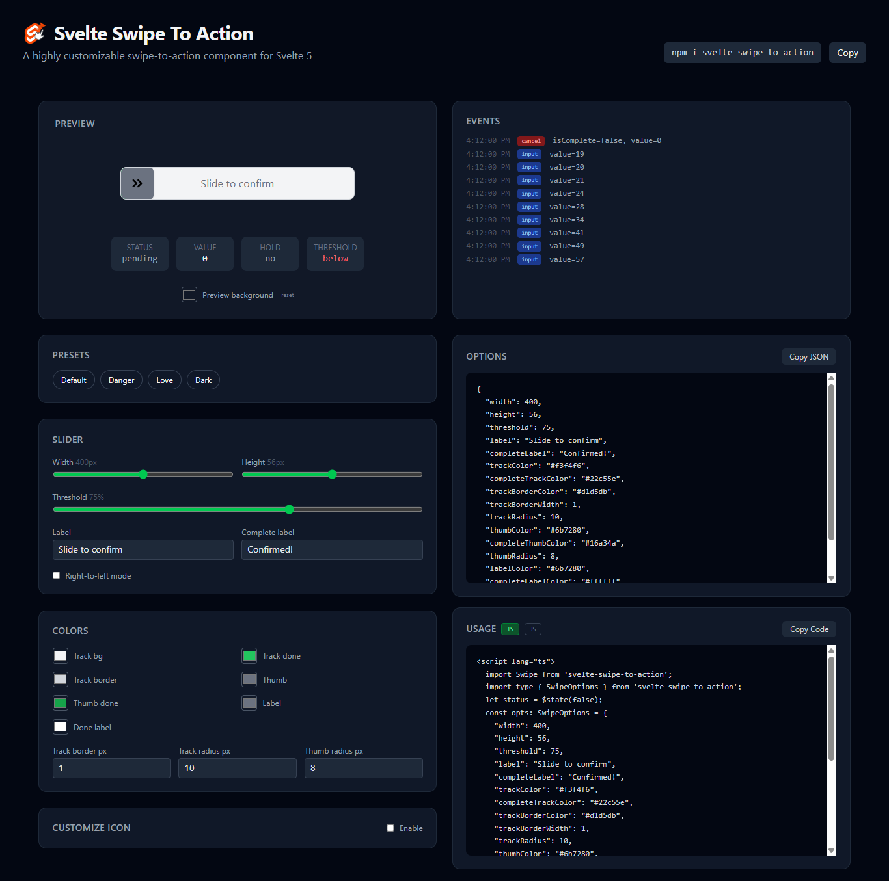

# svelte-swipe-to-action

A highly customizable swipe-to-action component for Svelte 5.

[](https://www.npmjs.com/package/svelte-swipe-to-action)
[](./LICENSE)

[**Live Demo**](https://svelte-swipe-ashy.vercel.app/)



## Installation

```bash
npm install svelte-swipe-to-action

# or

pnpm add svelte-swipe-to-action
```

## Quick Start

```svelte
<script>
	import Swipe from 'svelte-swipe-to-action';

	let confirmed = $state(false);
</script>

<Swipe
	label="Slide to confirm"
	completeLabel="Confirmed!"
	bind:status={confirmed}
/>
```

## API

### State Props (`$bindable`)

These are two-way bindable state variables on the component.

| Prop | Type | Default | Description |
|---|---|---|---|
| `status` | `boolean` | `false` | Whether the slider is in completed state |
| `value` | `number` | `0` | Current slider value (0–100) |
| `hold` | `boolean` | `false` | Whether the thumb is being pressed/held |

### Options (`options` prop)

All appearance and behavior settings are grouped in a reactive `SwipeOptions` object:

```typescript
interface SwipeOptions {
	width?: number;              // default: 400
	height?: number;             // default: 56
	threshold?: number;          // default: 80 (percentage, 0–100)
	label?: string;              // default: 'Slide to confirm'
	completeLabel?: string;      // default: 'Confirmed!'

	// Track
	trackColor?: string;         // default: '#f3f4f6'
	completeTrackColor?: string; // default: '#22c55e'
	trackBorderColor?: string;   // default: '#d1d5db'
	trackBorderWidth?: number;   // default: 1
	trackRadius?: number;        // default: 10

	// Thumb
	thumbColor?: string;         // default: '#6b7280'
	completeThumbColor?: string; // default: '#16a34a'
	thumbRadius?: number;        // default: 8

	// Label
	labelColor?: string;         // default: '#6b7280'
	completeLabelColor?: string; // default: '#ffffff'
}
```

All properties in `options` are individually reactive — changing any one triggers an immediate update.

### Event Handlers

| Prop | Signature | Description |
|---|---|---|
| `oninput` | `(event: Event, value: number) => void` | Fires on every slider value change |
| `oncomplete` | `(event: Event, isComplete: boolean, value: number) => void` | Fires when the slider completes (passes threshold and is released) |
| `oncancel` | `(event: Event, isComplete: boolean, value: number) => void` | Fires when the slider is released before passing threshold |
| `onpassthreshold` | `(event: Event, side: boolean, value: number) => void` | Fires when the threshold is crossed in either direction (`true` = pass, `false` = back) |

### Custom Icons

Two approaches for customizing the chevron and checkmark icons:

**Approach 1 — SVG string props (reactive, no dependencies)**

```svelte
<script>
	import Swipe from 'svelte-swipe-to-action';

	const chevronSvg = `<svg xmlns="http://www.w3.org/2000/svg" width="32" height="32" fill="#000" viewBox="0 0 256 256"><path d="..."/></svg>`;
	const completeSvg = `<svg xmlns="http://www.w3.org/2000/svg" width="32" height="32" fill="#000" viewBox="0 0 256 256"><path d="..."/></svg>`;
</script>

<Swipe
	label="Slide to confirm"
	chevronIconSvg={chevronSvg}
	completeIconSvg={completeSvg}
/>
```

String props are fully reactive — changing the SVG string instantly updates the icon.

**Approach 2 — Snippets (for Svelte components)**

```svelte
<script>
	import Swipe from 'svelte-swipe-to-action';
	import { HandSwipeRight, Heart } from 'phosphor-svelte';
</script>

<Swipe label="Slide to confirm" completeLabel="Done!">
	{#snippet chevronIcon()}
		<HandSwipeRight />
	{/snippet}
	{#snippet completeIcon()}
		<Heart color="HotPink" weight="fill" />
	{/snippet}
</Swipe>
```

Snippets accept any Svelte component. For reactivity when toggling snippet props, wrap `<Swipe>` in `{#key}`.

### Other Props

| Prop | Type | Default | Description |
|---|---|---|---|
| `id` | `string` | — | HTML id attribute on the range input |
| `disabled` | `boolean` | `false` | Disables the slider |
| `class` | `string` | — | Additional CSS class on the track element |
| `rtl` | `boolean` | `false` | Right-to-left mode (sets `dir="rtl"` on track, swaps chevron direction) |

## Examples

### With Options Object

```svelte
<script>
	import Swipe from 'svelte-swipe-to-action';

	let status = $state(false);
	let opts = $state({
		width: 320,
		height: 60,
		threshold: 75,
		label: 'Slide to unlock',
		completeLabel: 'Unlocked!',
		completeTrackColor: '#4caf50',
		trackBorderRadius: 14,
		thumbRadius: 12
	});
</script>

<Swipe bind:status options={opts} />

{#if status}
	<p>Device unlocked!</p>
{/if}
```

### With All Event Handlers

```svelte
<script>
	import Swipe from 'svelte-swipe-to-action';

	let message = $state('');
	let status = $state(false);

	function handleComplete(event, isComplete, value) {
		message = 'Action completed!';
	}

	function handleCancel(event, isComplete, value) {
		message = 'Action canceled!';
	}

	function handleThreshold(event, side, value) {
		message = side ? 'Passed threshold' : 'Below threshold';
	}

	function handleInput(event, value) {
		console.log('Slider value:', value);
	}
</script>

<Swipe
	bind:status
	oncomplete={handleComplete}
	oncancel={handleCancel}
	onpassthreshold={handleThreshold}
	oninput={handleInput}
	label="Slide to submit"
	completeLabel="Submitted!"
/>

<p>{message}</p>
```

### RTL Support

```svelte
<Swipe rtl label="للحفظ" completeLabel="تم!" />
```

Sets `dir="rtl"` on the track element, swaps the chevron direction, and aligns the progress bar accordingly. No CSS transforms needed.

## Development

```bash
# Install dependencies
pnpm install

# Start dev server (demo page)
pnpm dev

# Build the library
pnpm build

# Type check
pnpm check
```

## License

MIT

Copyright (c) 2026 Nutchapon (Kodaicoder)
